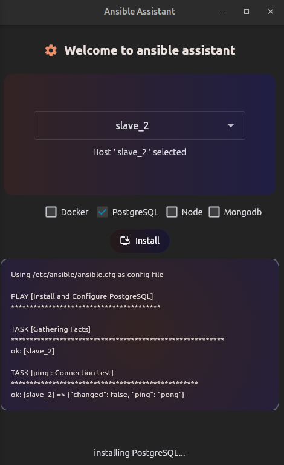

# Ansible Assistant


## 📌 Overview
**Ansible Assistant** is a Python-based **GUI tool** built with the **Flet framework** to simplify Ansible operations on remote hosts. It provides a user-friendly interface to install essential software packages on multiple servers effortlessly.

## ⚡ Features
- 📌 **Remote Host Selection**: Dynamically fetch and display hosts from SSH config.
- 🖥️ **Install Essential Packages**: Easily install Docker, PostgreSQL, Node.js, and MongoDB using Ansible.
- 🔄 **Automated Installations**: Executes Ansible commands for software installation.
- 🖱️ **Interactive UI**: Built using **Flet**, providing a smooth experience.
- 🔑 **SSH Key Support**: Uses private keys for authentication.
- 🌙 **Dark Mode UI**: Aesthetic design with themed colors.

## 📸 Screenshot


## 🚀 Installation
Clone this repository and navigate to the project directory:

```bash
# Clone the repository
git clone https://github.com/sepehrmdn77/ansible_assistant.git
cd ansible_assistant
```

## ▶️ Usage
Ensure you have Python installed, then install dependencies and run the application:

```bash
pip install flet ansible  # Install required libraries
python src/main.py  # Run the application
```

## ⚙️ Requirements
- Ubuntu/Linux system
- Python (3.8+ recommended)
- **Flet** framework (`pip install flet`)
- **Ansible** (`pip install ansible` or install via package manager)
- SSH Configuration with remote host details
- Sudo privileges for installations

## 🛠️ Configuration
- Ensure your SSH configuration (`~/.ssh/config`) contains the necessary hosts.
- Modify `ssh_hosts.py` if needed to customize host management.
- The application reads the host list dynamically.

## 🚀 Continuous Integration and Workflows

This repository uses GitHub Actions for Continuous Integration (CI). Below are the workflows implemented:

### **CI Workflow**
- **Path**: `.github/workflows/app_test.yml`
- **Trigger**: Runs on every push or pull request to the `main` branch.
- **Tasks**:
  - Lints the code using `flake8`.
  - Runs unit test using `pytest`.
  - Runs the app in test environment.

### **How to Use**
- Ensure that your changes are pushed to the `main` branch or open a pull request.
- The workflows automatically run and provide feedback on code quality.

### **Benefits**
- Automates testing and linting to save development time.
- Ensures code reliability by catching errors early in the process.

## 🤝 Contributing
Contributions are welcome! Feel free to fork the repository and submit a pull request.

## 📬 Contact
For issues or feature requests, please open an issue in the repository or reach out at [sepehrmaadani98@gmail.com].
